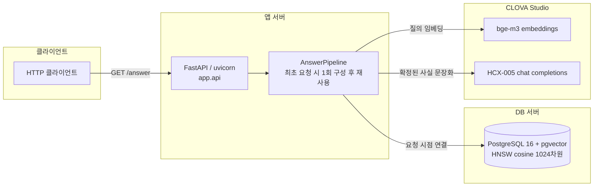
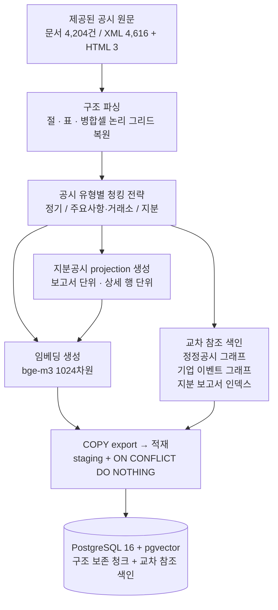
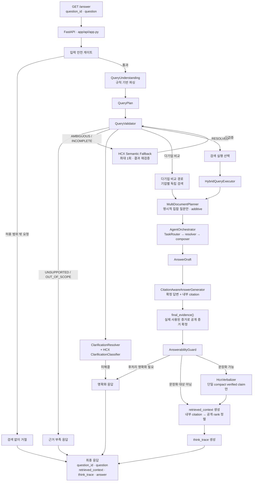
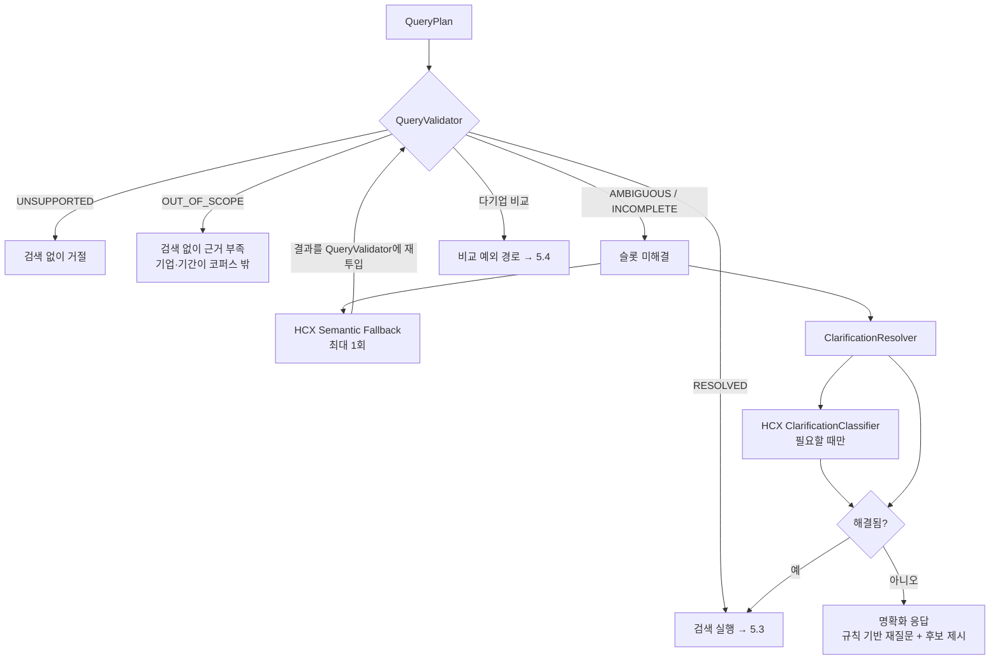
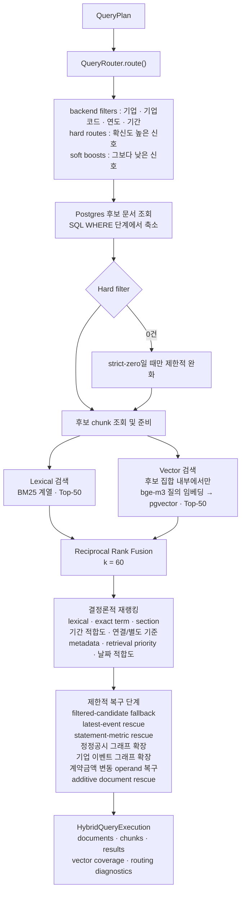
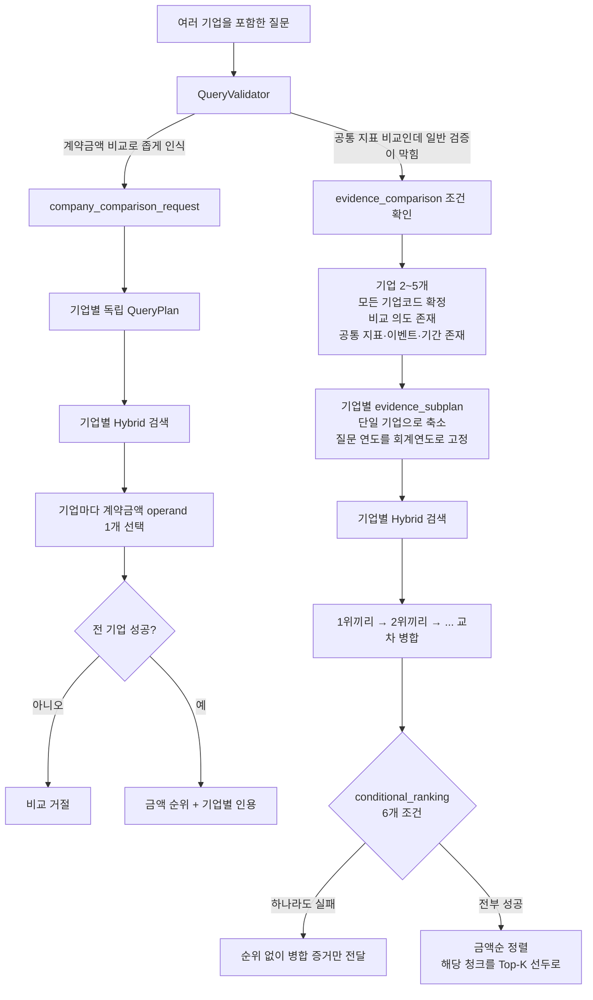
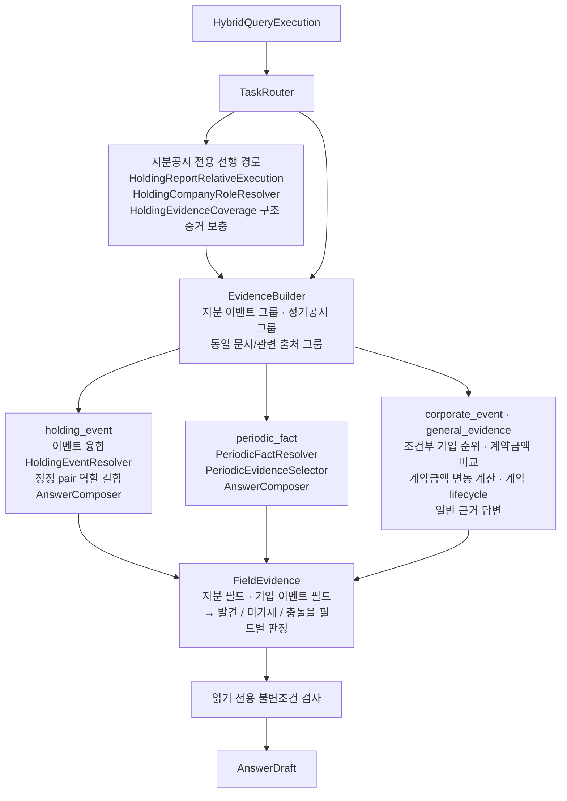

# Festival — 감사 가능한 DART 공시 질의응답 에이전트

공시 유형별 4트랙 해석과 **확정 후 문장화(Verify-then-Verbalize)** 구조

---

## 1. 제안 요약

국내 주요 상장기업의 DART 전자공시를 대상으로 **감사 가능한 답변**을 만드는 질의응답 API를 제안한다. 답에 적힌 숫자를 원문의 어느 보고서, 어느 절, 어느 표, 어느 행까지 되짚을 수 있어야 하고, 같은 질문이면 같은 근거와 같은 숫자가 나와야 한다.

주 사용자는 공시를 직접 읽기 어려운 **일반 투자자**로 두었다. 애널리스트는 "연결 기준으로", "정정 후 확정치로"를 질문에 스스로 붙이지만, 일반 사용자는 그런 조건이 필요하다는 사실부터 모르는 경우가 많다. 받은 답이 맞는지 확인할 수단도 없다. 그래서 조건을 붙이지 않아도 기준을 판정하고, 원문 위치를 같이 돌려주고, 확실하지 않으면 그럴듯하게 답하는 대신 되묻거나 모른다고 말하기로 했다. 리서치·컴플라이언스 실무자에게도 같은 구조가 그대로 쓰인다.

**공시 유형마다 읽는 방법을 다르게 두었다.** 정기공시는 수백 페이지에 K-IFRS 재무제표가 들어 있고, 지분공시는 한 건에 변동 이벤트가 여러 개 실려 있다. 문서 모양도 질문의 성격도 다른데, 제공된 코퍼스가 이미 4가지 유형으로 나뉘어 있었으니 그 경계를 그대로 쓰고 유형별로 청킹과 해석을 갈랐다.

**답은 먼저 확정하고, 문장은 그다음에 다듬는다.** 어느 공시의 어느 값을 쓸지, 인용을 어디에 붙일지는 규칙과 DB 조회가 정한다. HyperCLOVA X는 확정된 사실을 읽기 좋은 한국어로 옮기는 자리에만 들어온다. 이때 숫자는 placeholder로 빼 두었다가 되돌려 받는다.

실제 질문은 공시 한 건에서 끝나지 않는 경우가 많았다. 두 회사 지표를 비교하거나, 정정 이후 확정값을 묻거나, 한 기간에 체결된 계약을 전부 확인하는 식이다. 그래서 여러 문서를 같이 열고 교차하는 경로를 따로 두었다. 비교가 성립하지 않으면 순위는 내지 않고 근거만 보여 준다.

---

## 2. 문제 정의

### 2.1 공시 유형마다 질문의 성격이 달랐다

작업을 시작하고 가장 먼저 막힌 곳은 분류였다. 정확도는 그다음이었다. "공시를 검색해서 답한다"는 한 문장으로 보이지만, 열어 보니 성격이 다른 4가지 유형을 한꺼번에 다루는 일이었다.

| 유형 (`doc_group`) | 유형별 주목한 부분 |
|---|---|
| `periodic` 정기공시 | K-IFRS 재무제표에서 항목·기간·기준(연결/별도)·집계 단위 등 여러 좌표를 동시에 특정해야 한다 |
| `major` 주요사항보고서 | 이벤트 하나에 딸린 여러 조건을 묶음으로 유지해야 한다 |
| `exchange` 거래소공시 | 금액과 일정에 더해 이후의 정정·해지 이력까지 따라가야 한다 |
| `holding` 지분공시 | 한 보고서 안의 여러 변동 이벤트 중 하나를, 보고자 기준으로 골라야 한다 |

정기공시에서 "2025년 1분기 매출액"을 물으면 한 숫자가 나오려면 좌표가 여럿 맞아야 한다. 항목, 기간, 연결인지 별도인지, 분기 값인지 누적인지, 전사인지 부문인지를 동시에 특정해야 한다. 연결재무제표와 별도재무제표는 같은 계정 이름에 다른 숫자를 담고 나란히 실린다. 질문에 "연결"이 없어도 사용자는 보통 연결을 기대하는데, 검색은 그 맥락을 모른다. 당기·전기 비교표와 부문 정보까지 겹치면 같은 지표 이름에 표가 대여섯 개씩 나왔다.

지분공시는 종류가 달랐다. 대량보유상황보고서 한 건에 변동 이벤트가 시계열로 여러 개 들어가고, 보고자와 발행회사가 같이 등장한다. "하이브가 에스엠 지분을 처분한 뒤 보유 주식 수"를 물으면 회사 이름은 두 개인데 답은 한 문서 안에 있다. 누가 보고자인지 못 가리면 엉뚱한 쪽 숫자를 내게 된다. 특별관계자 지분이 같이 실리는 경우도 흔했다.

수시공시는 분류 자체가 함정이었다. 한 번 틀린 사례가 있다. `자기주식취득신탁계약해지`는 문자열에 "계약해지"가 있어 거래소공시로 잡히지만 실제로는 주요사항보고서이다. 비슷한 이름으로는 안 갈리고, 제도를 알아야 갈린다.

4가지 유형을 청킹 하나와 프롬프트 하나로 덮으면 각 유형에서 조금씩 틀렸다. 더 곤란한 것은 어디서 틀렸는지 짚기가 어렵다는 점이었다.

### 2.2 표를 자르면 답이 사라졌다

공시에서 사람이 궁금해하는 값은 거의 전부 표 안에 있다. 색인한 청크의 약 79%가 표에서 나왔고 본문은 21%였다. 표를 놓치면 대부분을 놓치는 셈이다.

공시 표는 병합 셀이 많고 헤더가 2~3단으로 겹친다. 고정 길이로 자르면 헤더 행과 데이터 행이 서로 다른 조각으로 흩어졌다. 검색은 맞아도 답은 틀렸다. 조각에 `1,234,567`이 남아 있어도 매출액인지 매출원가인지, 당기인지 전기인지, 연결인지 별도인지 알 수 없었다.

색인에서 구조를 잃으면 뒤에서 되살릴 방법이 없다. 검색만 올려서 피할 수 있는 문제가 아니었다.

### 2.3 실제 질문은 공시 한 건에서 끝나지 않았다

가장 까다로웠던 질문은 공시를 여러 건 같이 봐야 하는 것들이었다.

정정공시가 대표적이다. 원본이 나온 뒤 정정본이 일부 항목만 바꿔 다시 나온다. 질문에 가장 잘 맞는 문서를 찾아도 그 값이 이미 정정됐을 수 있다. 유사도 검색은 원본과 정정본의 관계를 보지 못한다. "정정 이후 확정된 당기순이익"에 답하려면 두 문서를 같이 봐야 했다.

기업 간 비교도 같다. "A사와 B사 중 어느 쪽 공급계약 규모가 큰가"는 서로 다른 문서에서 값을 뽑은 뒤 비교해야 한다. 한쪽이 사업보고서 연간 금액이고 다른 쪽이 분기보고서 누적이면, 두 숫자를 나란히 놓는 것부터가 틀린 답이다. 값을 찾는 일보다 비교가 성립하는지 보는 일이 더 어려웠다.

열거형 질문도 있었다. "2025년에 체결한 시설투자를 전부 알려달라"에는 최적 문서 하나가 없다. 빠뜨리지 않고 모으는 것이 답이다.

흔한 RAG 구성은 세 경우 모두에서 약했다. "질문과 가장 비슷한 문서 상위 몇 건"은 문서 하나가 답 하나에 대응한다고 가정하기 때문이다.

### 2.4 답하면 안 되는 질문과 답할 수 없는 질문을 구분해야 했다

마지막은 답을 만들기 전의 문제였다. 답해도 되는 질문인지부터 봐야 하고, 답할 수 없는 이유도 한 가지가 아니다.

근거가 코퍼스 밖에 있는 질문이 있다. 데이터는 2026년 6월 19일 접수분까지이므로 그 이후 공시는 근거가 없다. 질문 자체가 빈약한 경우도 있다. "그 회사 계약 취소된 거 어떻게 됐어?"에는 회사가 없고, '취소'가 계약 해지인지 투자 계획 철회인지도 알 수 없다. 처음부터 답하면 안 되는 요청도 있다. 매수 판단이나 주가 전망인데, 주 사용자를 일반 투자자로 두면 이런 질문은 예외가 아니라 일상이다.

셋은 갈래가 달라야 한다. 범위 밖이면 근거가 없다고 말하고, 빈약하면 되묻고, 답하면 안 되는 요청은 검색도 하지 않고 거절해야 한다. 전부 "정보를 찾을 수 없습니다"로 뭉개면 사용자는 시스템이 무엇을 모르는지 알 수 없다.

---

## 3. 접근 방식

2장에서 막힌 4가지를 풀기 위해 아래를 정했다. 분류 기준을 어디서 가져올지, 유형별 처리를 어디서부터 갈지, 공시 한 건을 넘는 질문을 어떻게 받을지, 답하지 않을 때를 어떻게 나눌지, 답이 맞고 빠지지 않았는지를 무엇으로 막을지. 공시를 잘 모르는 사람에게 이 장치들이 왜 더 필요한지는 3.6에서 이야기한다.

### 3.1 분류 기준 — 경계는 제도에서, 판단은 아래에서

상위 분류는 제도가 그어 놓은 4가지 유형을 그대로 썼다. **상위에서 하나를 고르면 나머지 트랙은 돌지 않는다.** 잘못 고르면 그 뒤가 전부 틀린 전제 위에서 돌아가고, 되돌릴 방법이 없다. 그런 판정은 자체 판단보다 제도 경계에 맡기는 편이 안전했다.

그 아래 세부 판단은 하위 규칙에 맡겼고, **규칙을 누적해서 돌리기로 했다.** 하나를 배타적으로 고르면 그 판정이 틀리는 순간 답도 끝이다. 같은 증거 위에 규칙이 겹치면 앞 단계가 비어도 다음 단계가 같은 후보를 다시 본다. 검색 복구가 그렇게 동작하고, 다중 문서 플래너는 기존 결과를 건드리지 않은 채 증거를 덧붙이며, 확신이 약한 라우팅 신호는 후보를 자르지 않고 점수에만 넣는다. 규칙 하나가 놓쳐도 답이 그 자리에서 무너지지 않고, 마지막 게이트가 근거 부족을 말할 수 있다.

줄이려 한 것은 **되돌릴 수 없는 판정의 수**였다. 판정이 많은 것 자체는 문제로 보지 않았다.

조건은 두 가지다. 작동한 하위 규칙은 모두 `think_trace`에 이름으로 남긴다. 어느 단계가 돌았는지, 어떤 복구가 붙었는지, 문장화가 왜 보류됐는지를 상태값으로 셀 수 있다. 규칙이 조용히 지나간 뒤 사라지면 부채가 되지만, 세어지면 기록이 된다. 그리고 규칙은 임의로 늘리지 않았다. 공시를 직접 열어 만든 질문에서 실패가 날 때마다 하나씩 나왔고, 각각 일반 규칙을 검증하는 테스트가 있다.

### 3.2 유형별 트랙을 청킹부터 분리

4가지 유형을 색인부터 다른 전략으로 자르고, 질문 시점에도 다른 해석 경로로 보낸다.

정기공시는 절과 재무제표 표 구조를 따라 자르고, 주요사항보고서와 거래소공시는 이벤트의 key-value를 통째로 남기고, 지분공시는 나중에 시계열로 묶을 수 있게 행 단위로 자른다. 지분공시에는 보고서 단위 projection과 상세 행 projection을 따로 만들어 여러 이벤트 중 하나를 집을 수 있게 했다.

질문 시점에는 `TaskRouter`가 `holding_event`, `periodic_fact`, `corporate_event`, `general_evidence` 중 하나로 보내고, 앞의 두 유형은 전용 resolver를 갖는다. 지분공시에는 선행 경로를 두었다. 미리 만든 보고서 인덱스가 집어 준 projection으로 증거를 바꾸고, 보고자·발행회사 역할을 정하고, 빠진 구조 증거를 채운다.

이렇게 갈라야 두 판단이 가능하다. 정기공시에서는 연결/별도를 슬롯으로 다룰 수 있다. 요청 기준이 확실하면 다른 기준의 표를 후보에서 빼고, 아니면 점수에만 넣는다. 지분공시에서는 여러 이벤트 중 무엇을 답할지 고를 수 있다. 경로가 하나였으면 둘 다 내릴 수 없었다.

### 3.3 여러 공시를 교차 비교하는 경로

2.3에 맞춰 경로를 세 갈래로 두었다.

정정공시는 검색 단계에서 그래프로 펼친다. `manifest.jsonl`에 `is_correction` 플래그가 있으니 그걸 출발점으로 원본과 정정본을 이어 두었고, 검색할 때 양쪽을 같이 후보에 올린다. 유사도로는 안 보이는 관계를 색인으로 따라간다.

기업 간 비교는 기업마다 계획을 따로 세워 검색한 뒤 결과를 교차해 합친다. 순위를 내기 전에 비교가 성립하는지만 본다. 요구한 보고서 종류가 정해졌는지, 각 기업에 같은 종류가 있는지, 기준 연도가 같은지, 금액이 하나씩인지, 그 금액이 총액·누적인지. 하나라도 어긋나면 순위 없이 합친 근거만 넘긴다. 사업보고서 연간 금액과 분기보고서 누적을 나란히 놓고 "A가 더 크다"고 말하는 것보다 순위를 안 내는 편이 낫다.

열거형 질문은 `MultiDocumentPlanner`가 맡는다. 기간·이벤트 집합이 분명한 질문에만 움직이고, 기존 검색 결과는 건드리지 않은 채 뒤에 증거를 붙인다. 빠진 문서는 hydration으로 채운다.

### 3.4 답하지 않는 방식의 분리

`QueryValidator`가 질문을 다섯 상태로 나누고 상태마다 다른 길로 보낸다. `UNSUPPORTED`는 검색 없이 거절, `OUT_OF_SCOPE`는 검색 없이 근거 부족, `AMBIGUOUS`와 `INCOMPLETE`는 해결을 시도한 뒤 필요하면 되묻기, `RESOLVED`만 검색으로 간다.

되물을 때도 근거가 있어야 한다. 요청한 접수일자의 공시가 없으면 그냥 거절하지 않고, `manifest.jsonl`에 실제로 있는 날짜만 보여 주며 되묻는다. 없는 날짜는 내밀지 않는다.

### 3.5 정확성과 완결성

정확성은 인용으로, 빠짐은 게이트로 막았다.

사실 문장마다 청크 단위 인용을 붙였다. 문서만 가리키면 사용자가 300페이지를 다시 뒤져야 한다. 절과 표 행까지 내려가야 옆에서 대조할 수 있어서, 내부 평가에서도 문서 단위와 청크 단위를 따로 쟀다. 공개하는 근거는 검색된 전부가 아니라 답을 실제로 받친 것만 남긴다.

"답이 맞는가"와 "요청한 것을 다 답했는가"는 다른 검사다. `AnswerabilityGuard`가 요청 필드와 다중 문서 완전성을 보고, `FieldEvidence`가 필드마다 발견·미기재·충돌을 가른다. 값이 없는 것, 공시에 안 적힌 것, 근거가 서로 다른 것은 사용자에게 다르게 보여야 한다. 답을 짧게 만들려고 검증된 값을 지우는 쪽은 피하고, 값은 두고 표현만 줄였다.

질의 이해부터 문장화까지 계층은 모두 구현되어 있고, 제출 인터페이스는 응답 최상위 다섯 필드로 고정해 계약 테스트로 묶었다. 단위 테스트 약 793건이 DB·임베딩·언어 모델 자격증명 없이 통과한다. 평가 산출물은 실행 파라미터와 체크섬을 같이 남긴다.

### 3.6 일반 사용자를 전제한 설계

앞 절의 장치들은 전문가용처럼 보이지만, 공시를 잘 모르는 사람을 받을수록 더 필요하다.

애널리스트는 "연결 기준으로", "정정 후 확정치로", "누적 말고 당분기로"를 알아서 붙인다. 일반 사용자는 그런 구분이 있는지도 모르고 묻는다. 유형별 트랙과 연결/별도 판정은 조건을 붙일 줄 아는 사람에게는 편의가 되지만, 붙일 줄 모르는 사람에게는 정답과 오답을 가른다.

검증도 그렇다. 전문가는 답이 이상하면 원문을 연다. 일반 사용자에게는 그럴 수단이 없다. 300페이지 사업보고서를 가리키는 인용은 전문가에게는 출발점이라도 되지만, 처음 여는 사람에게는 빈 손짓이다. 절과 표 행까지 돌려줘야 답 옆에 원문을 놓고 대조할 수 있다.

더 위험한 것은 그럴듯한 오답이다. 근거가 없는데도 문장이 매끄러우면, 확인할 방법이 없는 사람에게 그 문장은 사실이 된다. 확실하지 않을 때 되묻거나 모른다고 말하는 것은 정확도를 버리는 일이 아니다.

질문도 짧다. "그 회사 계약 취소된 거 어떻게 됐어?"가 기본이면 되묻기는 부가 기능이 아니라 주 경로다. 없는 날짜를 선택지로 내밀면 그걸 사실로 받아들일 수 있어서, `manifest.jsonl`에 있는 후보만 보여 준다. "지금 매수해도 될까요?"도 실무자보다 일반 사용자가 더 자연스럽게 던진다. 그래서 입력 게이트와 출력 쪽 표현 차단을 빼면 안 된다고 보았고, 묻지 않은 해석이 붙는 길도 닫아 두었다.

확정 답변은 필드와 값의 조합이라 정확하지만 딱딱하다. 그 상태로 읽을 수 있는 사람은 결국 전문가뿐이다. 문장화는 그래서 넣었고, 그 단계에서 값이 안 바뀐다는 보장도 같이 있어야 했다. 읽기 쉬운 쪽과 정확한 쪽 중 하나만 고르지 않으려고 placeholder로 왕복시켰다.

DB나 외부 모델이 죽어도 요청 단위로 끊기고, 답이 빈 문자열로 나가는 경로는 없다. 실행 경로는 `think_trace`에 남는다. 운영 쪽 서술은 7장에 모았다.

---

## 4. 시스템 구성도

구성을 세 층으로 나눈다. 파싱·청킹·임베딩은 이미 끝나 동결되어 있고, 질문 시점에는 돌지 않는다.

### 4.1 배포 구성



DB 연결은 요청이 들어올 때 연다. DB가 내려가 있어도 API 서버는 뜨고 `/healthz`는 응답한다. 실패는 그 요청의 503으로만 끊기고, 프로세스 전체가 같이 죽지 않는다.

외부 호출은 두 개뿐이다. 임베딩은 코퍼스를 벡터화하고, 문장화는 확정된 문장을 다듬는다. 근거를 밖에서 가져오는 호출은 없다.

### 4.2 오프라인 데이터 파이프라인 (동결)



청킹은 고정 길이가 아니라 문서 구조를 따른다. 본문은 절에서 문단, 문장으로 내려가고, 표는 병합 셀을 논리 그리드로 복원한 뒤 헤더와 행 묶음 단위로 자른다. 표 행을 문자 길이 때문에 자르지 않고, 큰 표를 나눌 때도 모든 행 묶음에 같은 헤더와 표 문맥을 반복해 넣는다.

각 청크는 결정론적 ID와 함께 문서·절·표 provenance, 앞뒤 청크 링크를 가진다. 검색용으로는 원문과 따로, 기업·공시·절 경로를 담은 `retrieval_text`를 두었다. 원문은 그대로 두고 검색 신호만 보강한다.

### 4.3 런타임 파이프라인

질문 한 건이 지나가는 경로이다. 굵은 분기는 조기 종료이고, 이유는 각각 다르다.



---

## 5. 주요 기능 흐름도

### 5.1 입력 안전 게이트

질문이 들어오면 기업을 해석하거나 검색하기 전에, 그 요청을 받아도 되는지부터 본다. 걸리면 DB 조회도 임베딩 호출도 하지 않고 끝낸다. 범주는 다섯이다.

| 범주 | 차단하는 요청 |
|---|---|
| `future_prediction` | 주가 전망·예측 |
| `investment_advice` | 매수·매도 판단, 추천 종목 |
| `personal_or_private_news` | 개인 신상, 사생활, 루머, 주민등록번호·연락처 등 식별자를 포함하거나 요구하는 질문 |
| `external_side_effect` | 메일 발송, 문서 수정, 공시 삭제, 대신 주문 |
| `non_corpus_news` | 실시간·최신 뉴스 |

앞의 셋은 금융 규제에서 온다. 네 번째는 성격이 다르다. 질문 문장으로 에이전트에게 메일 발송이나 주문 같은 바깥 일을 시키려는 시도를 막는다. 다섯 번째는 근거를 코퍼스 안으로 묶기 위해서다.

판정은 공백을 정규화한 뒤 패턴으로 하고, 특정 회사명이나 질문 식별자에는 기대지 않는다.

### 5.2 질의 이해와 5-상태 검증

`QueryUnderstanding`이 규칙으로 질문을 구조화한다. 기업과 기업 코드, 태스크 유형, 지표나 이벤트, 기간과 날짜 기준, 보고자, 정정 의도, 비교 프레임, 검색어를 뽑아 `QueryPlan`을 만든다.

여기에는 언어 모델을 쓰지 않았다. 해석이 확률이면 같은 질문이 매번 다른 문서를 찾고, 답이 틀렸을 때 어디가 틀렸는지 짚을 수 없다. 파싱이 재현되어야 그다음도 디버깅할 수 있다.



언어 모델은 이 단계에서 보조로만 쓰이고, 결과는 다시 검증한다. semantic fallback은 최대 한 번이고 그 결과를 `QueryValidator`에 다시 넣는다. 모델이 슬롯을 채웠다는 이유만으로 검색이 시작되는 길은 없다.

비교 프레임은 실패 방향을 고정했다. 프레임이 `cross_company`나 `uncertain`이면 다기업 슬롯을 "한 기업 + 역할"로 바꾸지 않는다. 여기서 추측하면 되물어야 할 질문이 엉뚱한 대상에 대한 확신 있는 답으로 바뀐다.

### 5.3 하이브리드 검색



라우팅 신호는 확신도에 따라 갈린다. 높은 신호만 후보를 실제로 자르고, 낮은 신호는 점수에만 넣는다. 애매한 신호로 정답 문서를 빼 버리면 뒤에서 되돌릴 수 없다.

연결/별도 기준은 여기서 필터가 된다. 요청 기준이 확정되면 다른 기준으로 분류된 표는 후보에서 빠진다. 2.1의 K-IFRS 문제가 이 지점에서 잘린다.

융합 가중치는 RRF 0.60, 결정론적 점수 0.40이고 최종 Top-10을 만든다. 벡터 검색이 실패하면 lexical 결과로 이어 간다.

### 5.4 다기업 비교



`conditional_ranking`이 보는 여섯 조건은 이렇다. 금액 비교 질문인가, 요구한 보고서 종류가 정해졌는가, 각 기업에 같은 종류가 있는가, 기준 연도가 같은가, 기업별 금액이 정확히 하나인가, 그 금액에 총액·누적 표지가 있는가. 하나만 어긋나도 순위는 내지 않고 합친 근거만 넘긴다.

### 5.5 공시 유형별 해석 트랙

`AgentOrchestrator`는 검색 결과를 읽기만 한다. 순서·점수·후보 payload를 바꾸지 않는다는 불변조건을 요청마다 검사한다. 추론이 검색을 뒤에서 고쳐 쓰기 시작하면, 어느 단계가 답을 정했는지 따라갈 수 없다.



지분공시 선행 경로는 2.1의 문제를 직접 받는다. 미리 만든 인덱스가 집은 보고서와 projection으로 증거를 바꾸고, `HoldingCompanyRoleResolver`가 "하이브가 에스엠 지분을 처분한 뒤"에서 누가 보고자이고 누가 발행회사인지 정한다. 정정 이력이 있으면 원본·정정 pair의 역할은 그대로 묶는다.

정기공시에서는 `PeriodicEvidenceSelector`가 연결/별도를 다시 보고 근거를 고른다. 검색 필터를 통과했어도 근거를 고를 때 한 번 더 본다.

`FieldEvidence`는 요청된 필드마다 발견 / 미기재 / 충돌을 가른다. 값이 없는 것, 공시에 안 적힌 것, 근거가 서로 다른 것은 다른 상황이다. 사용자에게도 다르게 보여야 한다.

### 5.6 답변 가능성 게이트

`CitationAwareAnswerGenerator`가 확정 답변과 내부 citation을 만들면, `final_evidence()`가 Orchestrator가 실제로 쓴 증거만 공개 집합으로 남긴다. 검색된 전부가 아니라 답을 받친 것만 밖으로 나간다.

`AnswerabilityGuard`는 다섯을 본다. 다중 문서 완전성, `FieldEvidence` 판정, 질문과 근거의 의미 일치, 요청 필드 충족, citation 존재. 결과는 후처리 명확화, 제한 응답, 문장화 진행이다.

이 중 의미 일치를 특히 봤다. 검색이 무언가를 찾아오고 resolver가 무언가를 뽑았다고 해서, 그게 질문에 대한 답인 것은 아니었다.

### 5.7 문장화 — 어디에 붙이고 어디에서 빼는가

여기까지 오면 답은 이미 정해져 있다. 남은 결정은 그 답을 언어 모델에 맡길지다. 답변마다
다르게 판단한다.

**수치를 확정한 답변에는 모델을 부르지 않는다.** 확정 답변은 이미 문장이다.

```text
삼성전자의 2025년 연결기준 매출액은 333,605,938백만원입니다. [1]
```

기업·기간·재무제표 기준·지표명은 해석 트랙이 확정한 값이고, 수치와 단위는 인용된 행에서
투영한 값이며, 인용은 레지스트리가 붙인다. 여기에 모델을 넣어서 얻을 것은 표현뿐이고,
잃을 수 있는 것은 수치다. 라이브 측정에서 실제로 잃었다. 단위가 없는 표의 수치에
`십억 원`이 붙어 나왔고, 척도가 다른 두 값을 비교해 작은 쪽을 크다고 답한 사례가 있었다.
그래서 이 경로는 모델이 닿지 않는다.

**대소 판정도 코드가 한다.** 두 기업 비교는 확정된 두 수치의 산술이다. 단위·기간·기준·지표가
양쪽 모두 같고 명시되어 있을 때만 비교하고, 그렇지 않으면 두 수치를 모두 제시한 뒤 비교하지
않은 이유를 말한다. 척도를 모르는 두 수를 나란히 놓는 것이 곧 오답이기 때문이다.

**서술형 답변에는 모델이 답을 쓴다.** 확정할 수치가 없는 질문 — "주요 투자 계획을 정리해줘",
"핵심 사업이 어떻게 변화했는지 설명해줘" — 은 반대다. 지킬 수치가 없고, 공시 원문 문단을
그대로 내보내면 가장 읽기 나쁜 답이 된다. 여기서는 서빙된 공시를 모델에 주고 답을 쓰게 한 뒤,
쓴 것을 검사한다.

| 검사 | 거부 사유 |
|---|---|
| 공시에 없고 공시 수치의 산술로도 설명되지 않는 수 | `unsupported_number:<값>` |
| 공시가 인쇄한 수치를 다른 척도로 바꿔 말함 | `rescaled_number:<값>` |
| 공시가 쓰지 않은 금액·수량 단위 | 해당 단위 제거 후 단위 미표기 고지 |
| 서빙되지 않은 근거를 인용 | `unknown_citation` |
| 추적 가능한 수치가 하나도 없음 | `no_citation` |
| 공시가 지목하지 않은 기업명 | `unsupplied_company` |
| 투자 권유·전망·평가 표현 | `evaluative_wording:<단어>` |
| 대소 판정을 모델이 직접 내림 | `comparison_verdict:<단어>` |

수치 검사는 자릿수 대조다. 답변의 모든 수는 공시에 인쇄되어 있거나, 공시 수치 둘의 차·합·
비중·증감률로 설명되어야 한다. 비교 질문이 요구하는 차이값은 어느 공시에도 없지만 산술이므로
검증할 수 있다. `383십억`처럼 척도를 바꿔 말한 경우도 그 값이 공시 수치와 같으면 통과하고,
`300,870,903십억`처럼 산술이 맞지 않으면 거부한다.

서식은 사실이 아니므로 버리지 않는다. 볼드·불릿은 제거하고 문장만 남긴다. 인용을 빠뜨린
답변도 버리지 않는다 — 답변의 수치가 어느 공시에 있는지는 조회로 알 수 있고, 그렇게 찾은
근거에만 인용을 붙인다.

**어느 경로에서 실패해도 비용이 없다.** 검사에 걸린 답변은 폐기되고 확정 답변이 그대로
나간다. 부분 수정은 하지 않는다. `think_trace`의 `answer_synthesis`·`answer_narration`에
상태가 남아, 문장화가 왜 보류됐는지 나중에 셀 수 있다.

## 6. 응답 효율

후보를 먼저 좁힌 것은 정확도를 위해서였다. 연산량도 같이 줄었다.

### 6.1 검색 범위 축소

가장 큰 절감은 검색에서 나온다. 어떤 질문도 색인 전체를 대상으로 하지 않는다.

기업 코드·공시 유형·기간이 SQL `WHERE`로 문서를 먼저 걸러낸다. 그 문서의 청크만 후보로 가져오고, lexical 검색과 벡터 검색은 그 안에서만 돈다. 벡터 검색은 후보 청크 ID 목록을 조건으로 받아 코사인 순위를 매기므로, 임베딩 테이블 전체를 훑는 길은 없다.

후보 수에도 상한이 있다. 랭킹 신호가 있을 때만 최종 Top-K의 다섯 배(최소 50)까지 가져오고, 없으면 Top-K만 가져온다.

### 6.2 비용 순서대로 배치한 파이프라인

비싼 일을 뒤로 미뤘다. 입력 게이트와 코퍼스 범위 판정이 DB 조회와 임베딩보다 앞에 있다. 답하면 안 되는 요청이나 범위 밖 질문은 외부 호출 없이, DB 조회 없이 끝난다.

되물어야 하는 질문도 검색을 돌려 본 뒤 묻는 게 아니다. 되물어야 한다고 판단되면 그 자리에서 묻는다.

파이프라인 객체는 첫 요청에서 한 번 만들고 재사용한다. DB 백엔드, 임베딩 클라이언트, 검색 실행기, 색인, 오케스트레이터가 요청마다 다시 만들어지지 않아 콜드 스타트는 한 번뿐이다.

### 6.3 언어 모델 호출 최소화

질문 한 건에서 언어 모델 호출은 1회 아니면 2회다.

질의 이해는 규칙이 먼저 읽는다. 그다음 HyperCLOVA X가 같은 질문을 한 번 읽는데, 규칙이 이미
해석을 끝낸 질문도 예외가 아니다. 이 호출은 계획을 바꾸지 않는다 — 결정적으로 해석된 계획이
그대로 서빙되고, 모델이 무엇으로 읽었는지는 `think_trace`에 기록만 남는다. 에이전트의 워크플로가
이 모델 위에서 돈다는 요건을, 구조가 아니라 실행으로 만족시키기 위해서다.

두 번째 호출은 서술형 답변에만 일어난다. 수치를 확정한 답변은 호출을 건너뛰므로(5.7), 비용이
드는 쪽과 모델이 필요한 쪽이 겹치지 않는다.

온도는 0이다. 같은 입력에는 같은 문장이 나오고, 캐싱과 회귀 검증 둘 다에 편하다.

### 6.4 외부 지연 격리

외부 호출이 느려져도 사용자를 붙잡지 않기로 했다. 문장화가 늦으면 기다리지 않고 이미 있는 확정 답변을 바로 보낸다. 벡터 검색이 실패하면 lexical로 이어 간다.

바깥 서비스가 나빠져도 응답이 늘어지는 대신 문장이 조금 딱딱해진다. 답 자체는 이미 정해져 있어서 내용이 빠지거나 비는 길은 없다.

### 6.5 런타임 부담 제거

파싱, 청킹, projection, 교차 참조 색인, 임베딩은 전부 오프라인에서 끝냈다. 질문 시점에는 조회와 순위 계산만 한다.

배포도 가볍다. 검색 데이터가 이미지가 아니라 PostgreSQL에 있어서 원문 코퍼스를 이미지에 넣거나 마운트할 필요가 없다. 빌드 컨텍스트는 14.16 GB에서 6.26 MB로 줄었다.

---

## 7. 신뢰성과 안전성

### 7.1 근거 추적성

사실 문장은 청크와 원본 참조까지 따라가는 인용을 갖는다. `retrieved_context`에는 순위, 청크 ID, 문서 ID, 청크 유형, 절 경로, 보고서명, 기업 코드, 기업명, 접수일자, 기간, 원문, 검색 텍스트, 원본 참조, provenance가 같이 실린다.

중요한 것은 인용 단위였다. 300페이지 사업보고서를 가리키는 것은 인용이 아니다. 어느 절, 어느 표의 어느 행 묶음인지까지 남겨야 처음 여는 사람도 답 옆에서 원문을 대조할 수 있다. 내부 평가에서도 청크 단위를 문서 단위와 따로 쟀다. 문서는 맞는데 청크가 어긋난 실패는 최종 성공률에 안 보이기 때문이다.

### 7.2 관측 가능성

`think_trace`는 모델의 속마음이 아니다. 어떤 컴포넌트가 돌았고 무엇으로 끝났는지의 실행 요약이다. 이름과 개수, 상태값만 담고 중간 추론 텍스트는 넣지 않는다.

태스크 유형, 경로, 실행된 단계, 검색 결과 수, 선택된 근거 수, 답변 가능 여부, 경고, 문장화 상태가 들어간다. 답이 이상할 때 이 값으로 층을 짚을 수 있다. 기업 인식인지, 라우팅인지, 검색인지, resolver인지, 표현인지를 가른다. 3.1에서 말한 "하위 규칙은 세어져야 한다"가 여기에 있다.

### 7.3 컴플라이언스

투자 권유와 전망은 입력과 출력 양쪽에서 막는다. 입력에서는 그런 요청 자체를 거절하고(5.1), 문장화에서 매수·매도·목표주가가 새로 나오면 그 응답을 쓰지 않는다(5.7). 묻지 않은 해석이 붙는 길도 닫아 두었다. 공시에 없는 인과나 결론 문장도 같다.

개인 식별 정보는 입력에서 막는다. 주민등록번호·휴대전화번호·이메일·여권번호·결제카드가 질문에 있거나, 특정인 연락처를 요구하면 검색과 임베딩 전에 거절한다(5.1). 다만 **코퍼스 원문에는 마스킹을 넣지 않았다.** 지분공시 보고자처럼 식별 정보가 원문에 있을 수 있는 자리가 있고, 지금은 그대로 색인된다. 검색 텍스트를 만들 때 가리는 일은 남은 과제다.

### 7.4 데이터 경계

답의 근거는 제공된 코퍼스만 쓴다. 바깥 웹 검색, 외부 데이터셋, 모델의 사전 지식은 근거로 쓰지 않는다.

정책이 아니라 구조로 막았다. 문장화에는 검색된 원문이 아니라 이미 확정된 사실만 들어간다. 코퍼스 밖 정보가 답에 붙을 길이 없다. 답이 코퍼스에 없으면 근거 부족으로 끝나는 것이 정상이다.

같은 구조가 프롬프트 주입도 막는다. 공시 본문에 모델을 겨냥한 지시가 있어도 그 원문은 언어 모델에 닿지 않는다. 질문 문장으로 시도하면 5.1의 입력 게이트가 검색 전에 거절한다.

### 7.5 운영 안전성

답은 항상 있다. 문장화가 꺼져 있든, 건너뛰든, 보류되든 확정 답변이 나가고, 빈 문자열이 나가는 길은 없다.

장애는 끊긴다. DB 연결은 요청 때 열리므로 DB가 내려가도 서버는 뜨고, 실패는 그 요청의 503으로 끝난다.

비밀값은 밖으로 안 나간다. 오류 응답에 접속 문자열·자격증명·traceback이 없고, API 키는 설정 객체의 `repr`에서도 빠진다. 평가 산출물을 남길 때 21개 패턴으로 비밀값을 훑고 결과를 기록한다. 마지막 실행은 검출이 없었다.

---

## 8. 사용자 시나리오

4가지 시나리오 모두 **공시를 직접 읽지 않는 일반 사용자**를 가정했다. 전문 용어나 보고서 이름은 붙이지 않고, 아는 만큼만 묻는 형태로 적었다. 아래는 API 호출로 적었지만, 실제 서비스에서는 이 위에 대화 화면이 올라간다.

### 시나리오 1 — 여러 이벤트 중 하나를 지목해야 하는 지분공시

```bash
curl -sG http://localhost:8000/answer \
--data-urlencode 'question_id=SC01' \
--data-urlencode 'question=하이브가 에스엠 지분을 처분한 뒤 보유 주식 수는?'
```

보고서 이름은 모르고 궁금한 것만 물었다. 회사 이름은 두 개인데 비교가 아니고, 답은 한 문서 안에 있다. `QueryUnderstanding`이 처분과 보고자 관계를 읽고, 지분공시 선행 경로가 하이브를 보고자, 에스엠을 발행회사로 묶는다. 미리 만든 보고서 인덱스가 그 이벤트의 projection을 집고, `HoldingEventResolver`가 변동 후 주식 수를 사실로 복원한다. 이벤트가 하나라 문장화 대상이 되고, placeholder 왕복을 통과하면 자연문으로 나간다.

`think_trace`에는 태스크 유형 `holding_event`, 경로 `holding_event_resolver`가 남는다.

### 시나리오 2 — K-IFRS 기준을 판정해야 하는 정기공시

```bash
curl -sG http://localhost:8000/answer \
--data-urlencode 'question_id=SC02' \
--data-urlencode 'question=현대자동차 2025년 1분기 연결 매출액은?'
```

기업·기간·지표와 함께 연결 기준이 파싱된다. 이 기준이 하드 필터가 되어 별도재무제표 표를 후보에서 빼고, 근거를 고를 때 한 번 더 본다. 같은 계정 이름의 표가 대여섯 개여도 어느 쪽을 볼지가 이 두 단계에서 정해진다.

일반 사용자는 보통 "연결"을 빼고 "현대자동차 2025년 1분기 매출액"이라고만 묻는다. 이때는 기준을 임의로 정하지 않는다. 후보를 자르지 않고 점수에만 쓰고, 근거를 고를 때 연결·별도를 다시 본 뒤 **어느 기준의 표에서 나온 값인지를 답의 근거와 같이 보여 준다.** 몰랐던 구분을 조용히 대신 정하지 않고, 답과 같이 드러낸다.

청크에 헤더와 표 문맥이 같이 있어서 `PeriodicFactResolver`가 그 숫자가 어느 항목의 어느 기간 값인지 복원할 수 있다. 절 경로와 provenance로 어느 재무제표의 어느 행인지 되짚을 수 있다.

### 시나리오 3 — 여러 공시를 교차해야 하는 복합 질의

> "A사와 B사의 2025년 공급계약 규모를 비교해줘"

기업마다 계획을 따로 세워 검색하고, 결과를 순위끼리 교차해 합친다. 순위를 내기 전에 여섯 조건을 본다. 같은 종류의 보고서인지, 기준 연도가 같은지, 금액이 하나씩인지, 총액·누적 표지가 있는지. 전부 맞을 때만 순위를 낸다.

조건이 어긋나면 순위 없이 두 회사 근거를 나란히 보여 준다. 비교는 사용자가 하게 된다. 틀린 비교를 받는 것보다 낫다.

### 시나리오 4 — 답하지 않는 것이 정답인 질문

일반 사용자가 자주 던지는 세 유형이고, 처리는 각각 다르다.

**답하면 안 되는 요청.** "삼성전자 지금 매수해도 될까요?" — 입력 게이트가 투자 판단으로 분류한다. 검색도 임베딩도 하지 않고 거절한다. 조심스럽게 답하는 것이 아니라, 시도하지 않는 것이 맞다.

**코퍼스 범위 밖.** "2026년 8월 15일에 접수된 공급계약 공시 내용은?" — 데이터는 2026년 6월 19일 접수분까지다. `QueryValidator`가 범위 밖으로 보고 검색 없이 끝낸다.

**모호한 질문.** "그 회사 계약 취소된 거 어떻게 됐어?" — 기업이 없고 '취소'의 뜻도 흐리다. `ClarificationResolver`가 규칙으로 되묻는다. *"말씀하신 '취소'가 체결된 계약의 이후 해지를 뜻하나요, 아니면 투자 계획의 철회를 뜻하나요?"*처럼 선택지를 같이 준다. 접수일자가 코퍼스에 없으면 `manifest.jsonl`에 있는 날짜만 보여 주며 되묻는다.

---

## 9. 검증

### 9.1 평가 질문을 만든 방식

성능을 올리면서 가장 공을 들인 곳이 여기였다.

**무작위 질문이나 모델이 만든 질문은 쓰지 않았다.** 팀원이 공시를 직접 열고, 에이전트가 놓칠 자리를 골라 질문을 만들었다. 정정본과 원본이 같이 있는 보고서, 이벤트가 여러 개인 지분공시, 계정 이름이 비슷한 표가 여럿인 재무제표처럼, 사람도 헷갈리는 자리부터 찾았다. 그래야 약한 곳이 드러났다.

질문마다 카드를 만들고 **기대 동작을 먼저 적었다.** 정상 응답인지, 되묻기인지, 근거 부족인지를 질문을 만들 때 정하고, 반드시 들어가야 하는 표와 숫자, 추론하거나 만들어내면 안 되는 것, 흔히 빠지는 오답까지 같이 적었다. 판정 기준은 "답이 그럴듯한가"가 아니라 "미리 정한 기대와 맞는가"였다.

범위는 세 쪽으로 넓혔다. 20개 섹터 대표 기업 질문, 같은 산업 두 회사를 비교하는 질문 30건, 정정공시와 다중 문서와 파생 계산이 한꺼번에 걸리는 복합 질의. 답이 나오면 안 되는 코퍼스 밖 질문도 따로 모았다.

실패를 고칠 때는 규칙을 둘 두었다. **특정 회사명·날짜·질문 식별자에 맞춘 수정은 금지하고, 수정마다 일반 규칙을 검증하는 테스트를 같이 넣었다.** "이 회사면 이렇게"가 아니라 "이런 입력이면 이렇게"여야 통과했다. 3.1의 하위 규칙들이 여기서 나왔다. 규칙이 늘어도 특정 질문에 달라붙지 않게 한 장치이기도 하다.

### 9.2 내부 회귀 세트

개발 중 회귀를 잡기 위해 동결해 둔 자체 질의 60건의 측정치이다. 공식 평가 결과가 아니다.

| 지표 | 값 |
|---|---|
| Recall@1 | 0.483 |
| Recall@5 | 0.783 |
| Recall@10 | 0.900 |
| 답변 가능 판정률 | 1.000 |
| 문서 단위 인용 정확도 | 0.917 |
| 청크 단위 인용 정확도 | 0.883 |
| 근거 용어 포함률 | 0.950 |
| 최종 성공률 | 0.900 (54/60) |

수치는 확정 답변을 대상으로 쟀다. 평가 하네스는 `AgentOrchestrator → AnswerComposer → CitationAwareAnswerGenerator`에서 끝나고 문장화는 넣지 않는다. 인용 정확도와 최종 성공률은 **언어 모델 없이 나온 값**이다.

같은 질의를 lexical만으로 돌리면 Recall@1 0.233, Recall@5 0.367, Recall@10 0.433이다. 5.3의 벡터 검색·RRF·결정론적 재랭킹이 Recall@10을 0.467 끌어올린 몫이다.

유형을 나누면 강한 곳과 약한 곳이 갈린다.

| 유형 | 질의 | Recall@10 | 청크 인용 | 최종 성공 |
|---|---|---|---|---|
| `exchange` 거래소공시 | 8 | 1.000 | 1.000 | 1.000 |
| `major` 주요사항보고서 | 10 | 1.000 | 1.000 | 1.000 |
| `holding` 지분공시 | 28 | 0.893 | 0.893 | 0.893 |
| `periodic` 정기공시 | 14 | 0.786 | 0.714 | 0.786 |

2.1에서 정기공시를 가장 어렵다고 했는데 측정도 그쪽이다. 이벤트 하나가 문서 하나에 대응하는 거래소공시와 주요사항보고서는 전 항목 만점이고, 같은 계정 이름이 여러 표에 반복되는 정기공시만 청크 인용이 0.714로 내려간다. 유형별 트랙이 어디서 먹혔고 어디가 남았는지가 이 표에 보인다.

보존된 산출물에서 지분공시 질의 한 건의 출력이다. 질의가 집은 이벤트와 인용 목록만 옮겼다.

```text
question: 에스엠 하이브 2024년 3월 14일 현재 보유 수량 비율

보유 변동 내역
확인된 보유 변동 내역은 다음과 같습니다.
(...)
2.
회사: 에스엠 [4] [3]
보고자: (주)하이브 [4] [3]
변동일: 2024-03-14 [4] [3]
접수일: 2024-03-14 [4] [3]
변동 전 주식수: 2,098,811주 [4] [3]
증감 주식수: 868,948주 [4] [3]
변동 후 주식수: 2,967,759주 [4] [3]
변동 전 비율: 8.81% [4] [3]
변동 후 비율: 12.45% [4] [3]
증감 비율: 3.64% [4] [3]
변동 방향: 증가 [4] [3]
(...)

신뢰도
답변 신뢰도: 높음

인용
[3]
doc_id: holding_20240314001102
chunk_id: holding_20240314001102:ch_ba316a21e36e3205469e
[4]
doc_id: holding_20240314001102
chunk_id: holding_20240314001102:ch_ece41b0ed7765a7e9a8c
```

필드마다 인용 번호가 따로 붙는다. 7.1에서 인용 단위를 청크로 둔 결과가 이렇게 나오고, 청크 단위를 문서 단위와 따로 잴 수 있는 근거도 이 형태다. 같은 보고자의 다른 이벤트 5건이 같은 응답에 같이 실리는데, 이런 다중 이벤트 답변은 5.7 조건 때문에 문장화하지 않는다.

이 60건은 시험문제가 아니라 회귀 확인용이다. 새 수정의 근거는 늘 9.1 방식으로 찾은 질문과 일반화된 테스트였고, 이 세트는 마지막에만 돌렸다.

### 9.3 재현성

평가 산출물은 원본 그대로 두고, 실행 파라미터와 코드 커밋, 체크섬을 같이 기록한다. 무결성은 명령 한 줄로 확인한다.

```bash
python scripts/preserve_evaluation_artifact.py --verify
```

운영 파라미터(Top-K 10, lexical/vector Top-N 50, RRF k=60, 융합 0.60 / 결정론 0.40)는 이 회귀 세트를 통과한 설정과 같다. 문서에 적힌 값과 실제 서빙 값이 일치한다.

### 9.4 단위 테스트

약 793건이 PostgreSQL·임베딩·언어 모델 자격증명 없이 통과한다. 외부 의존 없이 로직을 검증할 수 있어야 확정 계층이 재현 가능하다.

`GET /answer`의 응답 최상위 5개 필드는 계약으로 고정되어 있고, 그걸 검사하는 테스트가 따로 있다.

### 9.5 남은 한계

**검색에서 놓친 6건.** 정답 근거가 Top-10에 못 들어온 경우다. 추론·인용·답변 가능성 단계에서
틀린 적은 없었다. 근거가 주어졌을 때 틀린 답을 만든 사례는 없다는 뜻이다.

사업 내용을 서술로 묻는 질문 3건은 정답 근거의 핵심 용어가 "TV", "모니터"처럼 여러 문서에
흔한 일반명사라 어휘가 특정 문서를 집지 못했다. 국민연금기금 지분 변동을 묻는 질문 3건은
같은 보고자가 여러 기업 공시에 반복되어 보고자 조건으로 후보가 안 좁혀졌다. 이 중 한 건은
문서는 맞았는데 청크가 어긋났다. 두 인용 정확도를 따로 잰 이유가 이 유형이다.

**구현하지 않은 것.** 아는 한계를 밝히는 편이 낫다고 판단해 그대로 적는다.

| 한계 | 현재 동작 |
|---|---|
| 두 기업 대소 판정이 항상 나오지는 않음 | 양쪽 단위가 공시에 명시된 경우에만 비교. 미상이면 두 수치를 모두 제시하고 비교하지 않은 이유를 고지 |
| 손익계산서의 단위 캡션이 인용 청크 밖에 있음 | 표 캡션이 다른 청크에 들어가, 서빙된 근거에서 척도를 복구할 수 없다. 위 한계의 원인 |
| 벡터 커버리지가 코퍼스 전체가 아님 | 후보에 임베딩이 없으면 lexical 단독으로 동작. 감추지 않고 `vector_coverage_absent:…`를 경고에 남긴다 |
| 프롬프트 주입 문구가 답변 서두에 반향됨 | 프롬프트 유출과 투자 의견 생성은 없으나, 질문 어구가 도입 문장에 남는다 |
| 정기공시 검색 성능이 가장 낮음 (R@1 0.29) | 측정으로 확인. 내부 회귀 세트가 지분공시에 편중되었던 결과 |

**단위를 모르면 비교하지 않는다**는 선택이 이 표의 첫 두 줄을 만든다. 척도가 다른 두 수를
비교하면 작은 쪽이 큰 쪽이 되고, 그 답은 자신 있게 틀린다. 두 수치를 모두 보여주고 무엇이
빠졌는지 말하는 쪽을 택했다.

개선 방향은 11장에 적었다.

## 10. 기대효과

사업보고서 한 건은 수백 페이지이고, 재무제표에는 같은 계정 이름이 여러 번 나온다. 일반 투자자가 직접 열어 원하는 값을 찾기란 사실상 어렵다. 아는 만큼만 물어도 그 값을 찾아 주고, 어느 보고서 어느 표에서 나왔는지도 같이 돌려준다.

연결과 별도를 가르고, 여러 지분 변동 중 하나를 집고, 신탁계약 해지를 주요사항보고서로 분류하는 일은 제도를 알아야 한다. 그 판단을 시스템이 맡으니 사용자는 조건을 일일이 붙이지 않아도 되고, 조건이 필요하다는 사실부터 몰라도 된다.

사실 문장마다 청크 인용이 있어서 원문 전체를 다시 읽지 않고 인용된 절과 표 행만 보면 된다. 일반 사용자에게는 답을 스스로 확인할 수 있는 거의 유일한 길이고, 실무자에게는 검수 시간을 줄이는 수단이다.

범위 밖이면 근거가 없다고 말하고, 모호하면 되묻는다. 그래서 응답이 나왔다는 것 자체가 게이트를 통과했다는 신호다. 항상 그럴듯한 답을 내는 시스템보다 답 하나하나를 믿을 수 있다. 답을 검증할 수단이 없는 사람에게는 이 차이가 더 크다.

---

## 11. 확장성

아래는 다른 계층을 건드리지 않고 가능하다.

**다른 공시 유형 추가** — 코퍼스는 정기·주요사항·거래소·지분 4가지로 한정되어 있다. 발행공시나 외부감사 관련 공시가 들어와도 그 유형의 청킹과 resolver만 추가하면 되고, 검색·증거 구성·답변 생성·안전 계층은 그대로 둔다. 상위 분류를 제도 경계에 맞춰 두어서 새 유형이 기존 4개 트랙과 겹치지 않는다.

**대상 기업과 기간 확대** — 오프라인 파이프라인만 다시 돌리면 되고 API 코드는 안 건드린다. 청킹이 유형별로 나뉘어 있어 새 기업이 들어와도 기존 전략이 그대로 적용된다.

**임베딩 모델 교체** — 환경변수 교체와 재색인만 하면 된다. 차원은 DB 제약으로 강제되므로, 안 맞는 조합이 조용히 서빙되는 일은 없다.

**성능 개선 여지** — 9.5의 두 실패 패턴은 재랭킹 신호 추가, 재랭킹 모드 교체, 융합 가중치 조정으로 다룰 수 있다. 답변·안전 계층은 건드리지 않는다.

---

## 부록 A. 기술 스택

| 구분 | 내용 |
|---|---|
| 코퍼스 (제공) | 상장기업 70개사 / 2023-01-02 ~ 2026-06-19 / 문서 4,204건 |
| 색인 (자체 구축) | 구조 보존 청크 (표 · 본문 · 지분 projection) + 정정공시 / 기업 이벤트 / 지분 보고서 색인 |
| 저장소 | PostgreSQL 16 + pgvector, HNSW cosine, 1024차원 |
| 임베딩 | 로컬 BGE-M3 추론(`bge_m3_local`), `BAAI/bge-m3` (CLOVA Studio 경로도 선택 가능) |
| 검색 | lexical Top-50 + vector Top-50 → RRF(k=60) → 결정론적 재랭킹 → Top-10 |
| 융합 가중치 | RRF 0.60 / 결정론적 점수 0.40 |
| 언어 모델 | HyperCLOVA X (HCX-005), temperature 0 — 질의 이해 전건 + 서술형 답변 |
| API | FastAPI + uvicorn, `GET /healthz`, `GET /answer` |
| 배포 | Docker (`python -m app.api`, 8000 포트) |

---

## 부록 B. API 명세

### `GET /healthz`

파이프라인을 구성하지 않으므로 DB·임베딩·문장화 상태와 무관하게 응답한다.

```json
{"status": "ok"}
```

### `GET /answer`

| 쿼리 파라미터 | 필수 | 설명 |
|---|---|---|
| `question_id` | 예 | 호출자가 지정하는 식별자. 공백만 있으면 422 |
| `question` | 예 | 한국어 질문. 공백만 있으면 422 |

응답 최상위는 정확히 다섯 필드이고, **모든 값은 문자열이다.** 주최측 공지가 정한 계약을
그대로 따랐다.

| 필드 | 타입 | 설명 |
|---|---|---|
| `question_id` | string | 요청 값 그대로 |
| `question` | string | 요청 값 그대로 |
| `retrieved_context` | string | 서빙된 Top-K 청크를 구분선으로 이어 붙인 텍스트 |
| `think_trace` | string | 실행 요약을 `key: value` 줄로 이어 붙인 텍스트 (7.2 참조) |
| `answer` | string | 최종 답변. 어떤 경우에도 빈 문자열이 아님 |

직렬화는 `app/api/serialization.py` 한 곳에서만 일어난다. 파이프라인 내부는 구조화된
형태로 동작하고, 문자열로 펴는 일은 API 경계에서 한 번만 한다. 구분 태그 선택은 참가팀
재량이라는 안내에 따라 사람이 읽을 수 있는 형태를 골랐다. 채점자가 읽는 필드이기 때문이다.

`retrieved_context` — 청크마다 다음 블록, 사이는 `-` 60자 구분선:

```text
[1] 삼성전자 · 사업보고서 (2025.12) · 접수일 2026-03-10
doc_id: periodic_20260310002820
chunk_id: periodic_20260310002820:ch_70f7b399fe050756e113
chunk_type: table | bm25_score: 12.34 | corp_code: 00126380 | 기준기간: 2025년 12월
섹션: III. 재무에 관한 사항 > 2-2. 연결 손익계산서
내용:
| 매출액 (주30) | 333,605,938 |
source_refs: [{"row":3,"field":"매출액"}]
provenance: {"table_id":"t7"}
```

청크 본문은 1,500자에서 행 경계로 자르고 `…(이하 생략)`을 남긴다. 공시 표 하나가 통째로
청크라 열 건이면 4.8만 자까지 갔고, 공지대로 초과분이 잘리면 뒤쪽 청크가 통째로 사라져
근거가 빈다. 앞을 살리고 뒤를 버리는 대신 열 건을 모두 남기고 각각을 줄였다.

`think_trace` — 한 줄에 한 항목. 리스트는 `stages`가 ` > `, `warnings`가 `; `로 이어지고,
하위 컴포넌트 요약은 compact JSON 한 줄이다.

### 오류 응답

| 상황 | 코드 | 본문 |
|---|---|---|
| `question` / `question_id` 누락·공백 | 422 | 검증 오류 |
| DB 접속 불가 | 503 | `{"reason": "database_unavailable", ...}` |
| 임베딩 서비스 불가 | 503 | `{"reason": "embedding_unavailable", ...}` |
| 그 외 실패 | 503 | `{"reason": "internal_error", ...}` |

접속 문자열·자격증명·traceback은 응답에 포함되지 않는다.

---

## 부록 C. 저장소 구조

```text
app/
api/          FastAPI 계층 (app, pipeline, schemas, settings, serialization)
parsing/      DART XML 파싱 · 공시 유형별 구조 청킹 · 검증
retrieval/    임베딩 · lexical/vector 검색 · 하이브리드 융합
reasoning/    질의 이해 · 검증 · 유형별 resolver · 증거 · composer
agent/        task router · orchestrator
generation/   확정 답변 생성 · 비교 판정 · 검증 · 문장화
exporting/    PostgreSQL COPY export
db/             스키마 · 인덱스 · 검증 · 벡터 SQL
data/corpus/    제공 메타데이터 + 자체 구축 색인
reports/        보존된 평가 산출물
scripts/        파이프라인 · 평가 · 진단 스크립트
tests/          단위 테스트 약 793건
qa-tool/        공시를 직접 보며 질의 카드를 만드는 작성 도구
```

---

## 부록 D. 평가 항목 대응

평가 항목과 담당 설계를 절 번호로 맞춰 두었다.

| 평가 항목 | 대응 설계 |
|---|---|
| 정확성 | 유형별 resolver와 연결/별도 하드 필터(3.2 · 5.3 · 5.5), 수치 답변은 모델을 거치지 않고 서빙하며 대소 판정도 코드가 수행(5.7) |
| 근거 완전성 | 요청 필드 충족과 다중 문서 완전성 검사(5.6), 필드별 발견·미기재·충돌 판정(5.5) |
| 요구사항 충족 | 응답 최상위 5필드를 모두 문자열로 고정하고 계약 테스트로 검사(9.4), 명세는 부록 B |
| 근거 기반 | 청크 단위 인용과 provenance(7.1), 실제 사용된 증거만 공개(5.6) |
| 추론 논리성 | 실행 경로와 상태값을 담은 `think_trace`(7.2) |
| 안전성 및 신뢰성 | 입력 안전 게이트와 개인 식별 정보 차단(5.1 · 7.3), 서술형 답변의 수치·단위·기업명·표현 사후 검증(5.7), 장애 격리와 비밀값 보호(7.5) |
| 정보한계 대응 | 거절·근거 부족·되묻기를 분리하는 5상태 판정(3.4 · 5.2), 실제 존재하는 후보만 제시하는 되묻기(5.2) |
| 근거 공시 표시 | 인용마다 공시명과 접수일을 답변에 표기하고, `retrieved_context`에 Top-K 청크와 문서·절·표 원본 참조를 수록(부록 B) |

---

## 부록 E. 제출물

| 항목 | 내용 |
|---|---|
| 소스코드 | `Dockerfile`, `requirements.txt`, `README.md` 포함 |
| 기술제안서 | 이 문서 |
| API 서버 | `GET /answer`, `GET /healthz` (명세는 부록 B, 실행 구성은 부록 A) |
| 평가 산출물 | `reports/`에 실행 파라미터·커밋·체크섬과 함께 보존 |
